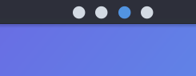
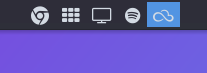

# Taglist
Got tired of the default Plasma Pager? Me too! That is why, inspired by panels
in tiling window managers, I made this plasmoid.





## Note to users
This plasmoid doesn't currently offer any customization. Furthermore, it
is intended to be used in a vertical panel only.

## Installation
Later there will be a proper mechanism.
At the moment, do the following:
```
git clone https://github.com/ishovkun/taglist
cd taglist
kpackagetool5 -t Plasma/Applet --install package
```

## Acknowledgments
Thanks to the authors of the Font Awesome.
